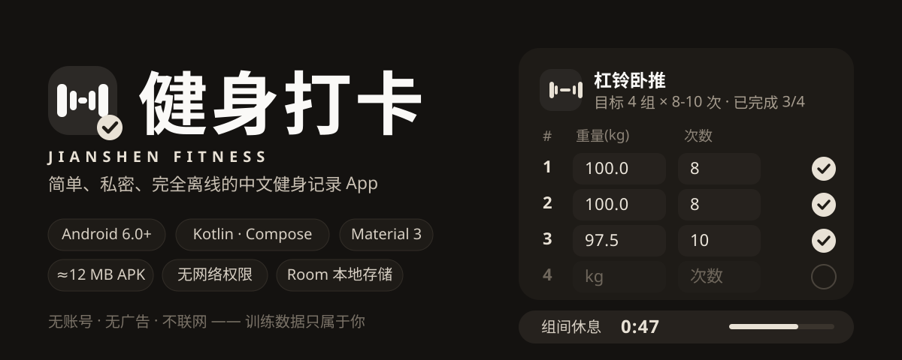
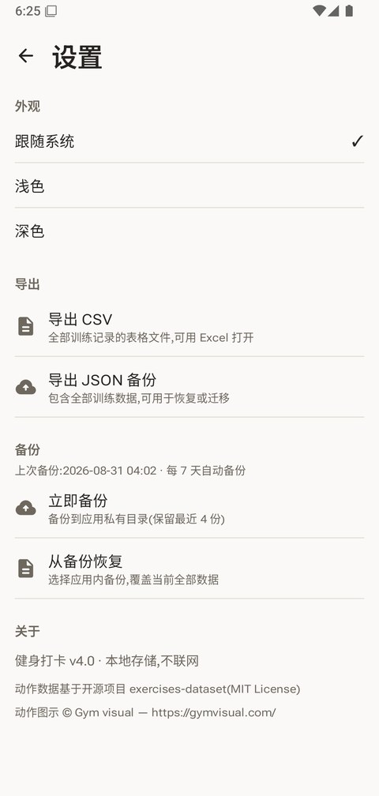
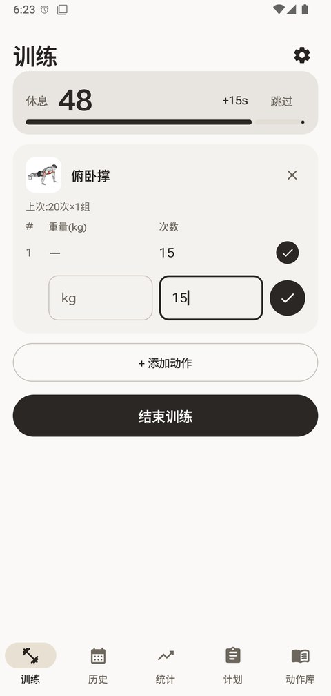
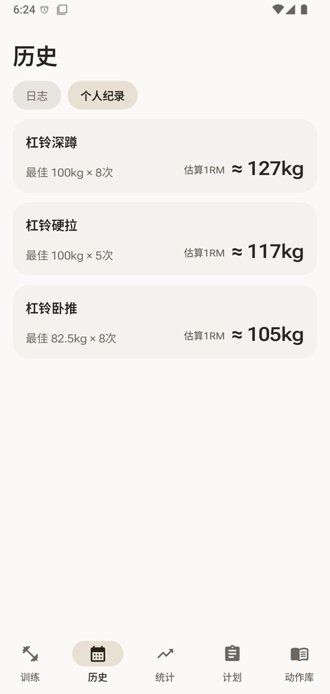
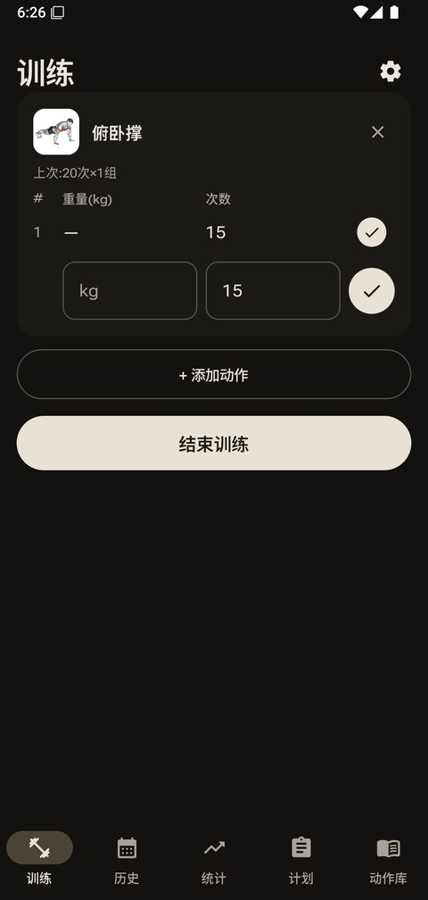

<div align="center">
  
</div>

| 训练 · 逐组打卡 | 统计 · 热力图与本周概览 | 计划 · 内置推/拉/腿模板 |
|:---:|:---:|:---:|
|  |  |  |

| 动作走势 · 每动作折线图 | 动作选择器 · 按部位分组 | 设置 · 导出与备份 |
|:---:|:---:|:---:|
|  |  |  |

| 组间休息 · 横幅倒计时 | 个人纪录 · 估算 1RM | 深色模式 · 三档外观 |
|:---:|:---:|:---:|
|  |  |  |

## 为什么是「健身打卡」

市面上的健身 App 要登录、要联网、要看广告。**健身打卡**反着来:一只约 12 MB 的 APK,装上就用,数据一辈子只留在你的手机里。这不是口号,是实现方式:

- **不申请网络权限** — 应用根本没有联网能力,想上报数据也做不到;无账号、无广告、无追踪
- **Room 本地数据库** — 记录、个人纪录、计划全部存本机;训练中途误杀进程,重开自动恢复
- **导出零存储权限** — CSV(带 BOM,Excel 直接打开)与 JSON 全量备份,经系统文件选择器保存
- **可迁移** — 换机前导出 JSON,新机覆盖式导入;导入前还会自动再备份一次,防手滑

## 核心功能

**训练记录**

- 逐组打卡:表格化录入,重量可选(徒手动作友好),草稿行自动带入上一组数值
- 组间休息计时器:勾完一组自动开始,页内横幅 + 系统通知;自然结束响铃并震动,60 / 90 / 120 秒长按可调

**动作库**

- 43 个力量动作 + 8 个有氧/拉伸动作(计时 + 可选距离)
- 中文名称、中文分步说明、动作图示与 GIF 演示

**统计与洞察**

- 6 个月训练热力图(自动滚到当前周,点天看当日摘要)、本周次数、连续训练周、总容量
- 个人纪录自动追踪,按 Epley 公式估算 1RM;徒手与有氧动作不参与估算
- 每个动作独立的走势折线图:最高重量 / 估算 1RM 切换

**训练计划**

- 自定义模板:目标组数 + 次数区间 + 可选目标重量,一键从模板开始训练
- 内置推 / 拉 / 腿三个经典模板,可删可改

**数据安全**

- 每 7 天自动备份到应用私有目录(保留 4 份)
- CSV / JSON 导出,JSON 覆盖式导入(导入前自动再备份)

**外观**

- 跟随系统 / 浅色 / 深色三档主题
- 数字采用 Roboto Flex 可变字体的宽体排版

## 下载安装

前往 [**Releases**](https://github.com/Ageha6912/jianshen/releases) 下载最新的 `app-release.apk`(约 12 MB),直接安装即可。

- 系统要求:Android 6.0(API 23)及以上
- 覆盖安装即可升级,数据自动保留;换机请先在 App 内「导出 JSON 备份」

## 从源码构建

```bash
git clone https://github.com/Ageha6912/jianshen.git
cd jianshen/FitnessApp
gradlew.bat assembleDebug
```

- 工具链:JDK 17、Android SDK(API 35)
- 仓库已配置国内镜像(Gradle 发行包走腾讯镜像、Maven 走阿里云镜像),境内网络可直接构建

## 致谢

- 动作数据:[free-exercise-db](https://github.com/yuhonas/free-exercise-db)(MIT License),含中文翻译
- 动作图示:© [Gym visual](https://gymvisual.com/)(App 内详情页与关于页已保留署名)
- 视觉设计参考:[LibreFit](https://github.com/LibreFitOrg/LibreFit)

## 许可

代码暂未设置开源许可证(保留所有权利);动作图示版权归 Gym visual 所有,未经授权请勿单独分发。

---

> 健身打卡 —— 你的训练数据,只属于你自己。
