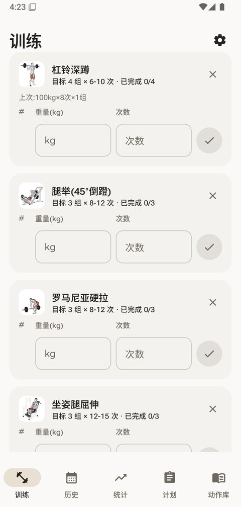
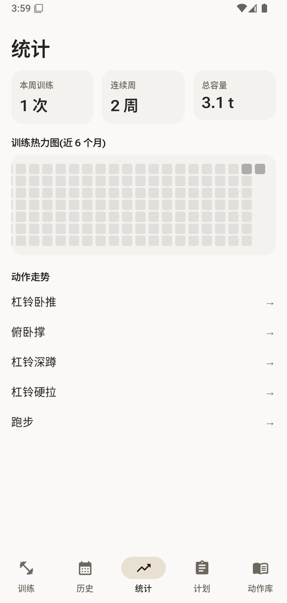
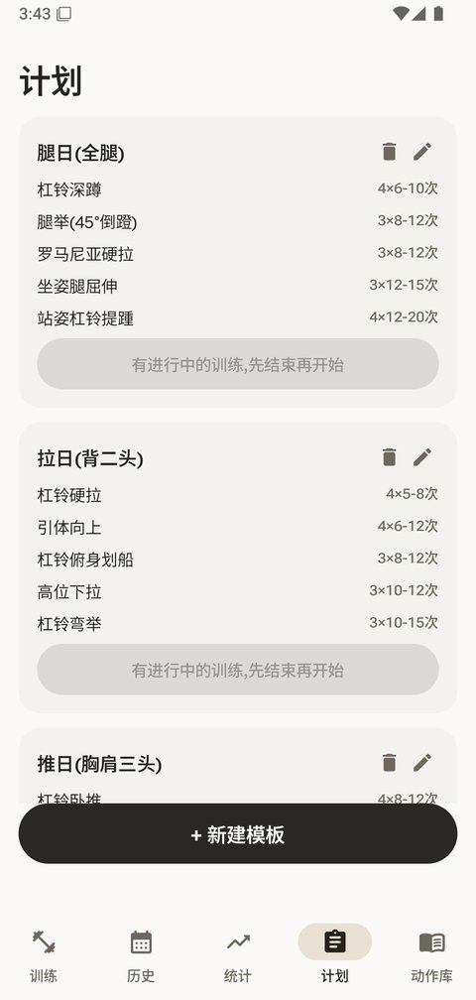
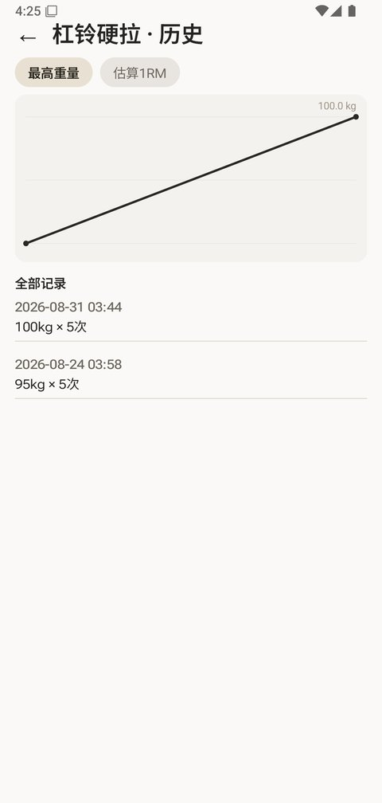
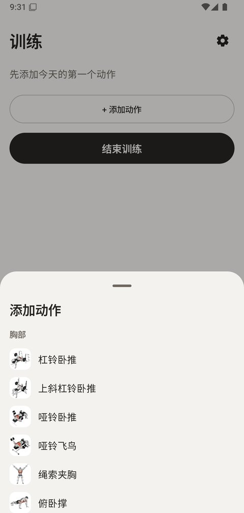

# 健身打卡 · JianShen Fitness

> 简单、私密、完全离线的中文健身记录 App。
> Kotlin + Jetpack Compose · Material 3 白金风 · 无账号 · 无广告 · 不联网

<p align="center">
  
  
  
  
  
</p>

## ✨ 特性

- **🏋️ 动作库** — 43 个力量动作 + 8 个有氧/拉伸动作(计时 + 距离记录),中文名称 + 中文分步说明 + 动作图示与 GIF 演示
- **📝 逐组训练记录** — 开始训练 → 添加动作 → 逐组记录(重量可选,徒手动作友好);中途退出自动恢复,不怕误杀进程
- **⏱️ 组间休息计时器** — 勾完一组自动开始:页内横幅 + 系统通知,60 / 90 / 120 秒长按可调
- **🏆 个人纪录** — 自动追踪每个动作的最佳组,按 Epley 公式估算 1RM;徒手与有氧动作不参与估算
- **📊 统计与走势** — 6 个月训练热力图、本周训练次数、连续训练周、总容量;每个动作都有独立的走势折线图(最高重量 / 估算 1RM)
- **📋 训练计划** — 自定义模板(目标组数 + 次数区间 + 可选目标重量),一键从模板开始;内置推 / 拉 / 腿三个经典模板
- **💾 备份与恢复** — 每 7 天自动备份到应用私有目录(保留 4 份),支持一键备份与覆盖式恢复
- **📤 数据导出** — CSV(带 BOM,Excel 直接打开)与 JSON 全量备份,经系统文件选择器保存,零存储权限
- **🌗 三档外观** — 跟随系统 / 浅色 / 深色,数字使用 Roboto Flex 可变字体的宽体排版
- **🔒 完全离线** — 数据只存在本机 Room 数据库;不申请网络权限,无追踪

## 📥 下载安装

前往 [**Releases**](https://github.com/Ageha6912/jianshen/releases) 页面下载最新的 `app-release.apk`(约 14 MB),直接安装即可。

- 系统要求:Android 6.0(API 23)及以上
- 升级安装无需卸载,数据自动保留;数据无云端,换机请先用 App 内「导出 JSON 备份」

## 🛠️ 从源码构建

```bash
git clone https://github.com/Ageha6912/jianshen.git
cd jianshen/FitnessApp
gradlew.bat assembleDebug
```

- 工具链:JDK 17、Android SDK(API 35)
- 仓库已配置国内镜像(Gradle 发行包走腾讯镜像、Maven 走阿里云镜像),境内网络可直接构建

## 🙏 致谢

- 动作数据:[exercises-dataset](https://github.com/yuhonas/free-exercise-db)(MIT License),含中文翻译
- 动作图示:© [Gym visual](https://gymvisual.com/)(App 内详情页与关于页已保留署名)
- 视觉设计参考:[LibreFit](https://github.com/LibreFitOrg/LibreFit)

## 📄 许可

代码暂未设置开源许可证(保留所有权利);动作图示版权归 Gym visual 所有,未经授权请勿单独分发。
